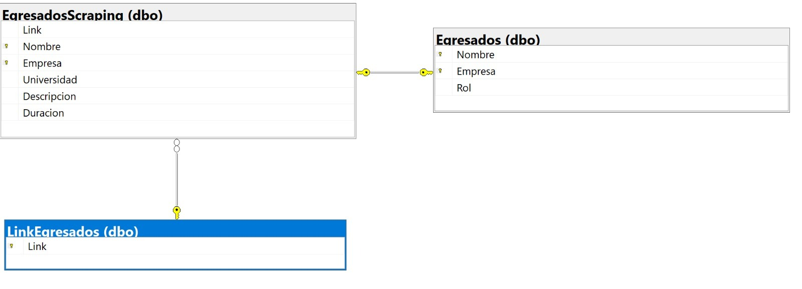

# Bienvenidos a la Base de Datos
Esta sección se enfoca principalmente en el almacenamiento de la información utilizada a lo largo del proyecto. Se utilizará una base de datos relacional, en específico SQL Server bajo la infraestructura de Azure, para el almacenamiento de la información. Se utilizará el lenguaje SQL para la manipulación de la información. Se utilizará el lenguaje Python para la automatización de la extracción de la información de la red social LinkedIn.

## Requisitos previos:
Para el correcto funcionamiento de este módulo se requiere un servidor SQL server, por el momento se está usando la infraestructura de Azure.

## Limitaciones Técnicas:
Se está usando la versión 2019 de SQL Server, con créditos de prueba en Azure por lo que se encuentra limitado economicamente el almacenamiento y el poder de procesamiento.

## Diseño del modulo:

### Diagrama de la Base de Datos

### **_Tabla LinkEgresados_**

### **_Tabla EgresadosScraping_**

### **_Tabla Egresados_**

---

## Descripción de las tablas

### LinkEgresados
Esta tabla almacenará los links de LinkedIn de los egresados que nos sirvan para nuestra muestra siguiendo los parametros establecidos (Que sea egresado de alguna de las licencituras a analizar y que cuente con experiencia laboral). Esta tabla se actualizará cada vez que se ejecute el módulo de Scraping de Links. Esta tabla cuenta con una llave primaria con el campo Link de tal manera que no se repitan los links.

### EgresadosScraping
Esta tabla almacenará la información de los egresados que se obtenga de LinkedIn.
Esta tabla cuenta con una llave foranea con el campo Link de la tabla LinkEgresados, de tal manera que se pueda relacionar la información de los egresados con su link correspondiente y haya consistencia de los datos al tener que subir la información de un egresado cuyo link ya se encuentra en la tabla LinkEgresados. De igual manera, esta tabla cuenta con una llave primaria con el campo Nombre y Empresa de tal manera que no se repitan los egresados. Esta tabla se actualizará cada vez que se ejecute el módulo de Scraping de Egresados.

### Egresados
Esta tabla almacenará la información de los egresados con su rol asignado. Esta tabla cuenta con una llave foranea con el campo Nombre y Empresa de la tabla EgresadosScraping, de tal manera que se pueda relacionar la información de los egresados con su Nombre y Empresa correspondiente y haya consistencia de los datos al tener que subir la información de un egresado cuyo Nombre y Empresa ya se encuentra en la tabla EgresadosScraping. De igual manera, esta tabla cuenta con una llave primaria con el campo Nombre y Empresa de tal manera que no se repitan los egresados. Esta tabla se actualizará cada vez que se ejecute el módulo de Procesamiento del Lenguaje Natural.