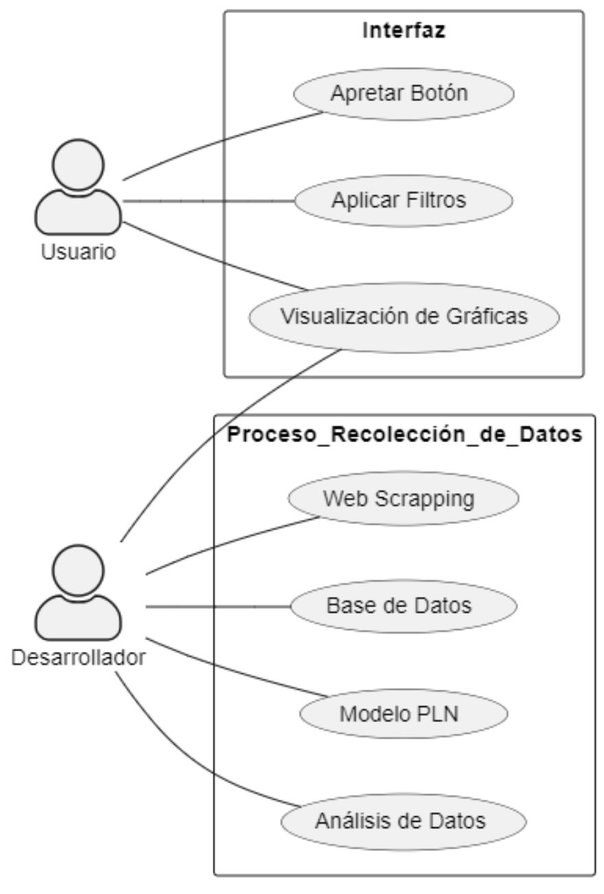

# **Priorización y Artefactos**
## **Historias De Usuario**
A continuación, se mencionan las historias de usuario que corresponden a nuestro proyecto. Se encuentran ordenadas en orden descendente en cuanto a importancia.

* Como coordinador de vinculación laboral, necesito conocer dónde están yendo a trabajar nuestros egresados para realizar negociaciones más adecuadas con las empresas correctas.

* Como estudiante actual, sería de gran utilidad conocer los roles más populares en el mercado actualmente, para así centrarme en aprender dichos temas.

* Como futuro estudiante de la carrera, me gustaría conocer mi campo laboral, para así tomar una decisión más inteligente en cuanto a mi selección de carrera.

* Como egresado de la carrera, es útil saber cuáles otros empleos puedo ser candidato, para así para mejorar mis condiciones laborales actuales.

* Como coordinador de la carrera, es útil saber los roles más populares, para así ofertar materias optativas acordes a la demanda del mercado actual.

## **Factibilidad e Importancia De Los Requerimientos**
En cuanto a la factibilidad, todos los requerimientos propuestos pueden ser cumplidos sin ningún problema, debido a que previamente se evaluó la viabilidad técnica en cuanto a mecanismos de Web Scrapping y resultó en éxito. Se dispone del tiempo suficiente, así como los conocimientos básicos necesarios para ejecutar el proyecto sin problema alguno. 

Todos los requisitos presentados anteriormente son los mínimos y estrictamente necesarios para cumplir con la funcionalidad final deseada.

## **Diagrama De Casos De Uso**

## **Diagramas de Clase**
Los diagramas de cada módulo del proyecto se encuentran en sus respectivas carpetas.