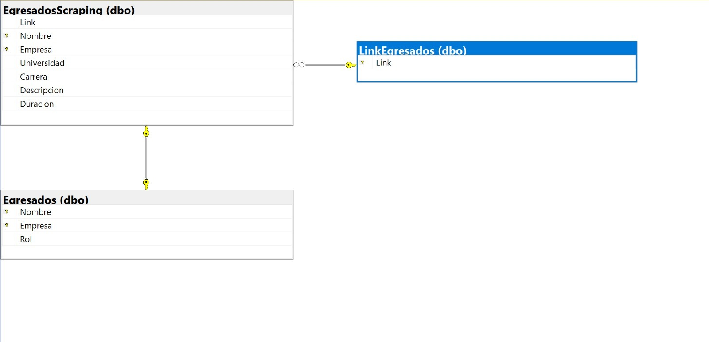
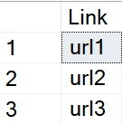
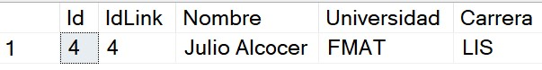
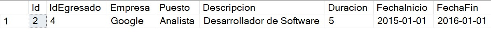
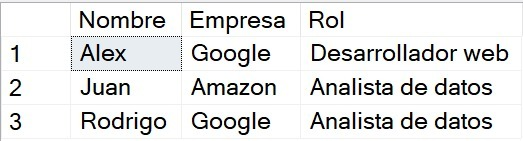

# Bienvenidos a la Base de Datos
Esta sección se enfoca principalmente en el almacenamiento de la información utilizada a lo largo del proyecto. Se utilizará una base de datos relacional, en específico SQL Server bajo la infraestructura de Azure, para el almacenamiento de la información. Se utilizará el lenguaje SQL para la manipulación de la información. Se utilizará el lenguaje Python para la automatización de la extracción de la información de la red social LinkedIn.

## Requisitos previos:
Para el correcto funcionamiento de este módulo se requiere un servidor SQL server, por el momento se está usando la infraestructura de Azure.

## Limitaciones Técnicas:
Se está usando la versión 2019 de SQL Server, con créditos de prueba en Azure por lo que se encuentra limitado economicamente el almacenamiento y el poder de procesamiento.

## Diseño del modulo:

### Diagrama de la Base de Datos

### **_Tabla LinkEgresados_**

### **_Tabla EgresadosInfo_**

### **_Tabla Experiencia_**

### **_Tabla Egresados_**

---

## Descripción de las tablas

### LinkEgresados
Esta tabla almacenará los links de LinkedIn de los egresados junto a sobre si son pivotes que nos sirvan para nuestra muestra siguiendo los parametros establecidos (Que sea egresado de alguna de las licencituras a analizar y que cuente con experiencia laboral). Esta tabla se actualizará cada vez que se ejecute el módulo de Scraping de Links. Esta tabla cuenta con una llave primaria con el campo id y una clausa Unique sobre los campos link y pivote de tal manera que no se repitan los links.

### EgresadosInfo
Esta tabla almacenará la información de los egresados que se obtenga de LinkedIn.
Esta tabla cuenta con una llave foranea con el campo Id de la tabla LinkEgresados, de tal manera que se pueda relacionar la información de los egresados con su link correspondiente y haya consistencia de los datos al tener que subir la información de un egresado cuyo link ya se encuentra en la tabla LinkEgresados. De igual manera, esta tabla cuenta con una llave primaria en el campo Id y una clausa Unique sobre los campos IdLink, Nombre, Universidad y Carrera de tal manera que no se repitan los egresados. Esta tabla se actualizará cada vez que se ejecute el módulo de Scraping de Egresados.

### Experiencia
Esta tabla almacenará la experencia de los egresados que se obtenga de LinkedIn. Esta tabla cuenta con una llave foranea con el campo Id de la tabla EgresadosInfo, de tal manera que se pueda relacionar la información de los egresados con su experiencia correspondiente y haya consistencia de los datos al tener que subir la experiencia de un egresado cuya información ya se encuentra en la tabla EgresadosInfo. De igual manera, esta tabla cuenta con una llave primaria en el campo Id y una clausa Unique sobre los campos IdEgresado, Empresa, Puesto y Descripción de tal manera que no se repitan los egresados. Esta tabla se actualizará cada vez que se ejecute el módulo de Scraping de Egresados.

### Egresados
Esta tabla almacenará la información de los egresados con su rol asignado. Esta tabla cuenta con una llave foranea con el campo Id de la tabla EgresadosInfo y el campo Id de la tabla Experiencia, de tal manera que se pueda relacionar toda la información de los egresados con su Rol correspondiente y haya consistencia de los datos al tener que subir el rol del egresado cuya informacion y experiencia ya se encuentra en la base de datos. De igual manera, esta tabla cuenta con una llave primaria con el campo IdEgresado, IdExperiencia y Rol de tal manera que no se repitan los egresados. Esta tabla se actualizará cada vez que se ejecute el módulo de Procesamiento del Lenguaje Natural.

## Descripción de los Stored Procedures

### AnalisisEmpresas
Esta SP recibe como parametros la universidad y la carrera que se desea analizar, se encarga de obtener la información de las empresas que se encuentran en la tabla Experiencia, para esto se filtra la tabla segun los parametros de universidad y carrera, posteriormente se cuenta el numero de veces que aparece cada empresa en la tabla y se divide entre el numero de egresados unicos que existen, luego se ordena de mayor a menor, para así obtener las empresas más populares entre los egresados de la carrera y universidad deseada.

### AnalsisRoles
Esta SP recibe como parametros la universidad y la carrera que se desea analizar, se encarga de obtener la información de los roles que se encuentran en la tabla Egresados, para esto se filtra la tabla segun los parametros de universidad y carrera, posteriormente se cuenta el numero de veces que aparece cada rol en la tabla y se divide entre el numero de egresados que existen en total, luego se ordena de mayor a menor, para así obtener los roles más populares entre los egresados de la carrera y universidad deseada.

### PromedioDuracion
Esta SP recibe como parametros la universidad y la carrera que se desea analizar, se encarga de obtener la información de la duracion de los egresados en sus empleos que se encuentran en la tabla Experiencia, para esto se filtra la tabla segun los parametros de universidad y carrera, posteriormente aplica la funcion AVG() propia de SQL server para poder obtener el promedio de la duracion de los empleos de los egresados de la carrera y universidad deseada.

## Funciones

### RecuperarUniversidades
Esta función se encarga de recuperar todas las universidades que se encuentran en la tabla EgresadosInfo, para esto se filtra la tabla y se obtienen las universidades unicas.

### RecuperarCarreras
Esta función se encarga de recuperar las carreras de una determinada universidad que se encuentran en la tabla EgresadosInfo, para esto se filtra la tabla segun la universidad y se obtienen las carreras unicas.
