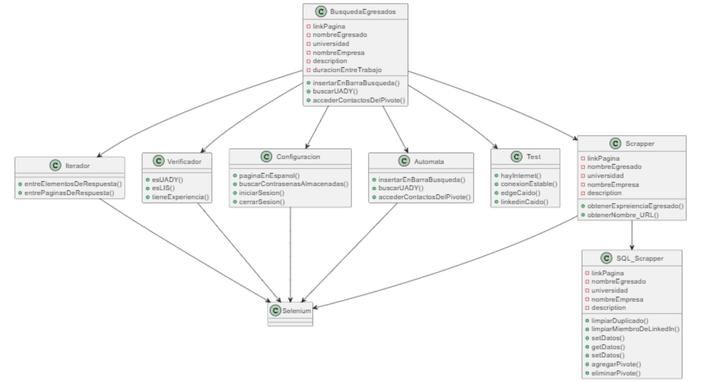
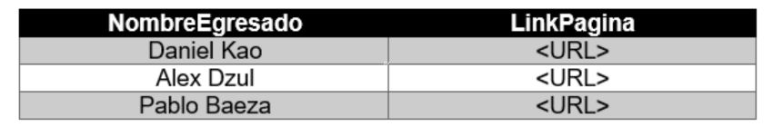
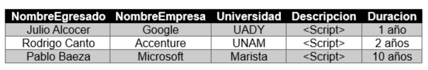

# Bienvenidos a Web Scraping
Esta sección se enfoca principalmente en la obtención de los perfiles de LinkedIn de los alumnos egresados, así como recuperar la información pertinente de dichos usuarios.

## Requisitos previos:
Para el correcto funcionamiento de este módulo se requiere una cuenta de LinkedIn, preferentemente con muchos contactos populares, es decir, que tenga muchas personas conectadas.
Por el momento se usará la cuenta personal de Pablo Ernesto Baeza Lara, pero se requerirá una nueva al entrar en producción, de uso exclusivo para el proyecto.

## Limitaciones Técnicas:
Después de múltiples pruebas se comprobó que BeutifulSoup4 no funciona para Web Scarping en LinkedIn, ya que al intentar realizar el procedimiento, éste devuelve un codigo de error http 999
(equivalente a 4**). El mismo caso se da con el framework Scrapy. Por lo tanto debido a esta serie de limitaciones, el presente módulo usará Selenium.

## Diseño del modulo:

### Diagramas de clase del módulo

### **_Tabla A_**

### **_Tabla B_**

---

## Descripción de las clases
#### **_La clase Selenium se omitirá ya que pertenece a una librería, por lo que se desconoce su estructura interna_**

### BusquedaEgresados
Por medio del tipo de búsqueda designado (alguno de los 3 métodos de la clase Automata), buscará a los egresados que cumplan las caracteristicas pertinentes. Puede considerarse el *main* del módulo de Web Scrapping.

#### **_¿Qué es un egresado?_**
Para este proyecto, consideramos un perfil/persona **_egresado_** como aquella que cumpla con todas las siguientes características:
- Estudió en la Universidad Autonoma de Yucatán.
- Estudió en la Facultad de Matemáticas.
- Finalizó sus estudios en la Licenciatura en Ingenieria de Software.
- Ha tenido al menos trabajo y está presente en el apartado de experiencia de LinkedIn.

### Iterador
Contiene 2 métodos que permitirá el moverse dentro de LinkedIn:
- entre_elementos_de_respuesta: Itera entre los resultados que devuelve una búsqueda arbitraria de LinkedIn.
- entre_paginas de respuesta: Manipula la URL de la actual página para así poder iterar para moverse entre páginas.

### Verificador
Contiene 3 métodos que validan que el perfil nos pueda servir como muestra, es decir, que cuente con las características de un *_egresado*:
- esUADY: Valida que el perfil corresponda a un egresado de la UADY.
- esLIS: Valida que el prefil sea de un egresado UADY de la carrera de la Licenciatura en Ingeniería de Software
- tieneExperiencia: Valida que el perfil tenga información en el apartado de *Experiencia* de LinkedIn.

### Configuracion
Contiene 4 métodos que permiten configurar la página a la forma que esperamos que tenga:
- paginaEnEspanol: Configura el navegador para que la página esté en español.
- buscarContrasenasAlmacenadas: 
- iniciarSesion: Inicia sesión en LinkedIn.
- cerrarSesion: Cierra sesión de LinkedIn.

### Automata
Contiene 3 métodos:
- Ingresar_cadena_en_barra_de_busqueda: Inserta en el buscador de LinkedIn ciertas cadenas predefinidas como "fmat software", "lis yucatan", entre otras.
- Ajustar_busqueda_mostrar_todo_UADY: Mediante la manipulación de los filtros de LinkedIn, mostrará a todas aquellas personas que estudien en la UADY (Estudios Superiores).
- Acceder_contactos_pivote_popular: Por medio de automatización se accederán a los contactos del perfil pivote.

### Test
Contiene 4 métodos en caso de que ocurra un error al momento de hacer el Web Scrapping:
- hayInternet: Valida que el dispositivo esté conectado a internet.
- conexionEstable: Valida que exista una conexión estable.
- edgeCaido: Valida que el navegador Microsoft Edge no esté caído.
- linkedinCaido: Valida que la aplicación web de LinkedIn no esté caída.

### Scraper
Contiene 2 métodos que servirán para obtener los datos necesarios:
- Obtener_nombre_y_URL: Obtiene los datos antes mencionados para posteriormente guardarlos en la tabla A. (Ver última imagen "Diagramas de clase del módulo")
- Experiencia_egresado: Obtiene los datos pertinentes del egresado para posteriormente guardarlos en la tabla B. (Ver última imagen "Diagramas de clase del módulo")

### SQL_Scraper
Contiene 6 metodos:
- Limpiar_duplicado (Tabla A): Limpia los elementos duplicados presentes en la tabla A.
- Limpiar_Miembro_de_LinkedIn(Tabla A): Limpia los elementos Miembro de LinkedIn (Perfiles anónimos) presentes en la tabla A
- Set_datos (Tabla A): Mediante procedimientos SQL envía los datos correspondientes a la Tabla A.
- Get_datos (Tabla A): Mediante procedimientos SQL obtiene los datos correspondientes a la Tabla A. 
- Set_datos (Tabla B): Mediante procedimientos SQL envía los datos correspondientes a la Tabla B.
- Agregar_Pivote: Agrega un elemento con la estructura de la Tabla A (nombre, url), a una tabla especial denominada *Pivotes*.
- Eliminar_Pivote: Elimina un elemento con la estructura de la Tabla A (nombre, url), a una tabla especial *Pivotes*.

#### **_¿Qué es un pivote?_**
Un usuario pivote es un perfil de LinkedIn el cual posee muchos "conectados" que pertenecen al grupo poblacional que estamos buscando. Al ser sus "amigos" en LinkedIn podemos acceder a todos sus "conectados", lo que facilita el proceso de búsqueda de los egresados. 

## Consideraciones generales
- El módulo está diseñado para funcionar con o sin la suscripción Premium, sin embargo tal vez la segunda opción ofrezca mejores resultados.
- Al momento de entregar el producto, la Tabla A ya se encontrará previamente cargada con datos de los egresados, para así poder buscar su "nueva experiencia" la n cantidad de veces necesaria.
- La tabla A se puede actualizar mediante el botón cuando se considere pertinente. (Ver imágenes anexo)
