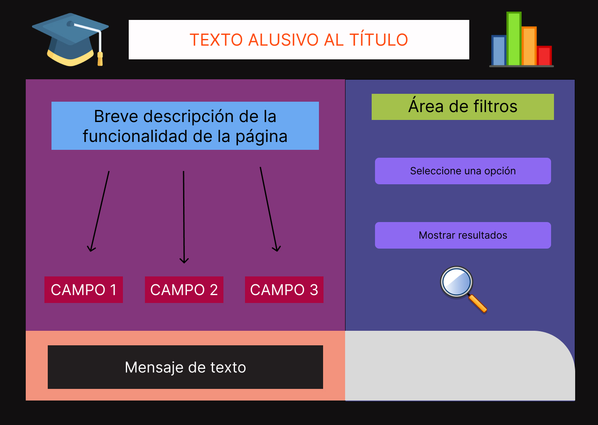
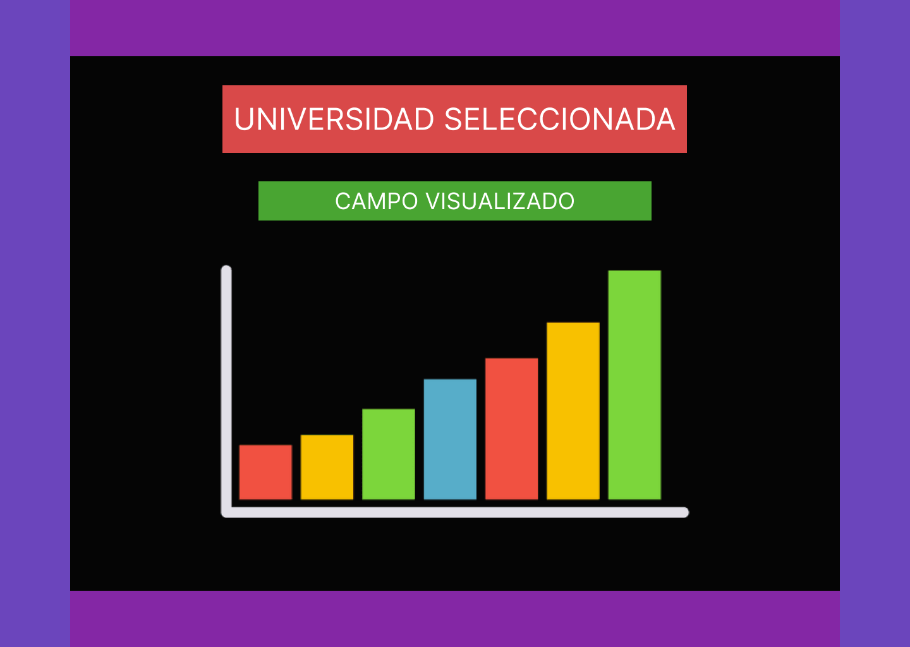

# **Interfaz de usuario**
---

#### Una vez conseguida la información que deseamos, es necesario buscar una forma apta de poder mostrar las conclusiones al usuario, para conseguir este fin, decidimos que la mejor opción es crear una página web, la cual nos ayudará a mostrar los resultados de una manera presentable y clara.

## _Visualización de la página web_
---
#### A grandes rasgos, podemos decir que la idea general de la estructura de la página web es la siguiente:

#### Los apartados de la página servirán para dar un formato presentable a la misma, contará con una breve explicación de su funcionalidad y de la información que brindará al usuario. Cuenta con 2 bototes interactivos, uno servirá para filtrar la información que se desea recopilar y el otro tiene la funcionalidad de mostrar explícitamente los resultados en pantalla.

## _Visualización de datos_
---

#### Para visualizar los datos, el esquema general es el que se presenta a continuación:

#### En este caso, los datos a mostrar dependerán del filtro elegido por el usuario anteriormente. Mostraremos el tipo de campo visualizado y la información pertinente de ese campo. (Se usó un diagrama de barras para fines visuales, sin embargo, el tipo de diagrama dependerá de la información que se deba mostrar).

## _SQL y ASP.NET Core_
---

#### Dado que los datos estadísticos se extraen de una base de datos en SQL, es necesario encontrar una forma de vincular nuestra página web con la base de datos. Para resolver esta problemática usaremos el framework ASP.NET Core. Este framework nos permitirá, mediante una ORM como Hibernate, mapear la base de datos bajo el paradigma orientado a obetos, de esta forma podrá ser manipulable con el lenguaje de programación C#. Con lo anterior será posible hacer consultas SQL de una manera más sencilla para poder extraer la información que necesitamos.

